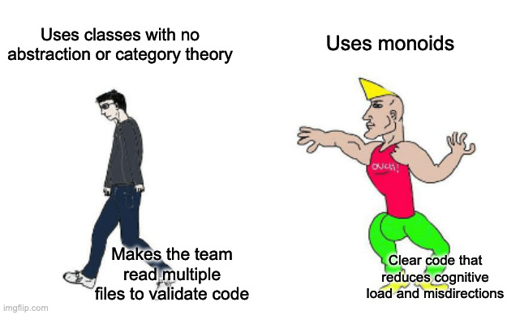

# Welcome

As mentioned in the [top-level-readme](../README.md), we've got a Federated Learning problem. We've got devices in every
house in the world (enough to make state nations weep in envy), and we use those to:

- train our centralized Deep Learning Model
- collect data to determine if the inhabitants have been naughty or nice


## Table of Contents

1) [Monoids Primer](#monoids-primer)
2) [Things to Note](#notes)
    - [Streaming Data](#streaming-data)
    - [Functions](#functions)
3) [Scenario](#scenario)
    - [Dec 26th (monoids_day_1)](#dec-26th)
    - [Dec 27th (monoids_day_2)](#dec-27th)
    - [Dec 28th (monoids_day_3_cleanup)](#dec-28th--the-cleanup)
    - [Dec 29th (monoids_day_4_final)](#dec-29th--monoids)
4) [Followups](#followups-)

# Monoids Primer

See [notes/monoids_101] for a quick and dirty introduction. It would be useful to read that first before coming back, as
it should prime
your thinking and help you to reflect on what you are reading.

# Notes

Some things to take note of as we explore

## Streaming Data

We should keep as little data as possible in-memory because that would be far too memory-intensive; Even big tech would
have trouble storing information about all the people on earth ;)
We want to test across various failure probabilities. Due to some issues in the hardware department (supply chain issues
and silicon shortages), we haven't been able to update all our in-home-model hardware.

## Functions

Denote the in-home-model (IoT model) as IHM, and our centralized server as TSP

- `ihm_success`: what the in-home model returns to the TSP in the event of a success
- `ihm_failure`: failure case of ^
- `tsp_processor`: what our server, The South Pole, does upon receiving the in-home model results

# Scenario

You've inherited the old architecture and decided to throw out most of it, only keeping the good parts
in `sol/day_0.py`. You ask your new boss, Noel, to get you a list of the task requirements for the MVP. Like any good
Elfgineer, you pick out a small city to test your changes on, hence why you aren't getting overwhelmed with results and
errors.

## Dec 26th

Noel comes running in with the list of tasks that you asked for:

### Tasklist

1) the average gradient calculation time of the IHMs (each one now reports the time taken)
2) how many IHMs failed in their gradient collection

The bosses are interested in identifying the critical areas first, which will give them an idea of how to improve the
stability of the systems.

### A Solution:

See [sol/monoids_day_1.py](sol/monoids_day_1.py)

## Dec 27th

Sleep-deprived, you stumble into work with a coffee in hand; all around, you see your bosses patting each other on the
back for
giving you the promotion. Surely, this isn't a good sign of things to come. Noel comes in looking sheepish with a
new list of tasks, and these look like a doozy:

### Tasklist

1) find the fastest and slowest IHMs (to fix up the connection/ bump up the hardware)
2) find the variance of the gradients and time taken to calculate the gradients

You knew they would ask for these things but didn't account for them when you first started coding. You grumble about "
past" you and how you ended up giving yourself more work.

### A Solution:

See [sol/monoids_day_2.py](sol/monoids_day_2.py)

## Dec 28th: The Cleanup

Completely exhausted, you stumble in. With bated breath, you stare at the door waiting for Noel to come bursting in
with more work, but it seems quiet. You hide under your desk and decide to clean up the code as best you can for future
maintainability.

### To the reader:

This is a cleanup day to make the code more modular, so we can more fairly compare it against the monoid
implementation.

### A Solution:

See [sol/monoids_day_3.py](sol/monoids_day_3_cleanup.py)

## Dec 29th: Monoids

You call up the previous Lead ML-Elfgineer, and chew him out for leaving you in such a mess. After your eggnog-fueled
rage has died down, he apologizes for the mess he left things in and the stress it is causing you. He shares that he has
been learning some category theory in his new role and that it might serve you well. After you remind him of the
distributed architecture, he advises you to
look up "Monoids".

Hmm, a `monoid`? You vaguely remember hearing your mathematician friends talking about it. Something about

> A monad is just a monoid in the category of endofunctors, what's the problem?

So, you decide to consult the ever-helpful [Wikipedia on Monoids](https://en.wikipedia.org/wiki/Monoid#Definition).
Well, a `monoid` in our context is a structure that obeys two basic properties:

```
1) has a "0" element
2) has a binary operation, ~,  that is associative i.e (a ~ b) ~ c == a ~ (b ~ c)
```

See [monoids.md](monoids.md) for a further discussion, but knowing just those two properties should be enough.
Especially
because you definitely read through the [monoids_101.md](notes/monoids_101.md), right?

### A Solution

See [sol/day_4_monoids.py](sol/monoids_day_4_final.py) for a solution.

# Discussion

Between `sol/monoids_day_3_cleanup.py` and `sol/monoids_day_4_final.py`, we see that the `__add__` encompases most of
the "busy" pipeline logic that was handled in `tsp_processor`.

What is nice about this is that when making changes, it is immediately clear where the code needs to go,
our `IHMResult`.
The benefit of this is not immediate, but in scenarios where various people have to step in and add code, it is easy to
let the code gradually "spaghetti-fy". As long as we "obey" the interface (accepted arguments, return values, etc.), we
can simply swap things out.

It is important to note that although both files are almost the same #LoC (which is a terrible metric), one is more
encapsulated than the other. One thing to remember throughout this process is that category is just a way of thinking
about the problem - it is not a rigid set of rules. It is important to not be dogmatic.



# Followups:

Some things to consider as we go into functors and monads:

- What if we wanted to efficiently find some information about a specific IHM? Instead of doing a simple linear search
  across the `ihm_results` in the `tsp_processor`?
- What if we wanted to trace our operations through the distributed system to accumulate information about function
  flow?
- What if we wanted to stop worrying about
  the [billion dollar mistake](https://www.infoq.com/presentations/Null-References-The-Billion-Dollar-Mistake-Tony-Hoare/)