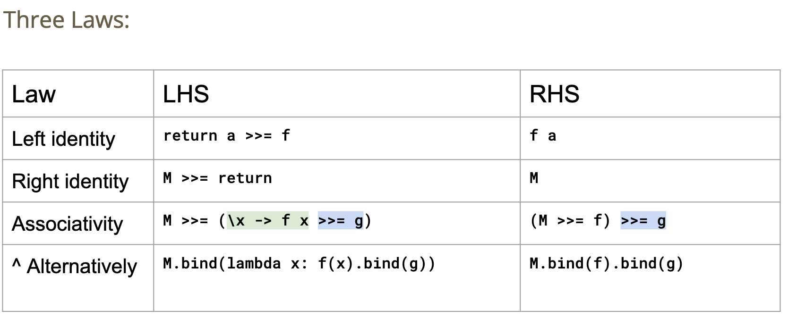

# Monads

## Table of Contents

1) [Intuition](#intuition)
2) [Class Declaration](#class-declaration)
    - [Disclaimer](#disclaimer)
3) [Laws and Properties](#laws-and-properties)
    - [Implementation Requirements](#implementation-requirements)
    - [Laws](#laws-)
4) [Examples](#examples)
    - [List](#over-a-list)
    - [Binary Search Tree](#a-binary-search-tree)
    - [A Custom Class](#a-custom-class)
5) [Closing Out](#closing-out)

## Intuition

Much like a `functor`, a `monad` can be thought of as a box. In fact, it can be thought of (in a reductionist manner) as
a functor, but with extra properties and requirements.

As in the case of functors, we describe how you can modify the contents of the box.

## Class Declaration

An intuition

### Haskell Class Declaration

```haskell
class Monad M where
    (>>=)  :: M T1 -> ( T1 -> M T2) -> M T2
    return ::   T1 -> M T1
```

where, as usual, `T1` and `T2` are abstract types. As usual, think of this as the abstract
base class that must be implemented to be considered a valid monad.

#### `>>=`

This line describes a monad (wrapping an instance of type `T1`), which takes in a function. That function takes a
type `T1` and
spits out a type `T2`. It then returns a type of M `T2`.

P.s this function is also known as `flatmap` or `bind` or any other number of names.
See [extra_credit.md - flatmap](extra_credit.md#flatmap) to
learn more about why it is called `flatmap`. In that we also discuss why the `(T1 -> M T2)` looks so familiar.

#### return

This operator is also known as `pure` or `unit`, depending on your language.

Think of this method as a way to "wrap up" your abstract thing into a monad. This allows you to then compose functions
together willy-nilly without fear.

#### Disclaimer

**Note** We modified the types and the monad definition.

- We modified the types to be more in line with a templated type (as you might see in typed languages)

## Laws and Properties

As usual, you can find the following on the [official haskell website](https://wiki.haskell.org/Monad). Below is the
original form

```
return a >>= k                  =  k a
m        >>= return             =  m
m        >>= (\x -> k x >>= h)  =  (m >>= k) >>= h
```

but for our discussion we use the attached image as I have restructured this to better fit our discussion and syntax.

### Implementation requirements/ properties

This section is, in my opinion, the hardest part of this entire tutorial; stick with me! I'd recommend looking at the
RHS first to
internalize it and then looking at the LHS.



For all the following consider these function signatures/ types

```
- M be a monad
- a, b and c be abstract types
- f: a -> M b
- g: b -> M c
```

- `f` maps type `a` to type `M b`

- `g` maps type `b` to type `M c`

#### Left Identity

The **RHS** is basically saying that we get a `M b`

Let's break down the **LHS**

```
return a >>= f  # we "put" a into a Monad, M
M a >>= f       # we then do a "bind" i.e apply f to a
M (f a)         # we then apply f onto a 
M (M b)         # by the flat
M b             
```

and we see that the two are equivalent!

#### Right Identity

This is far simpler than the above. The **RHS** is just a monad **around a type**. The LHS is

```
lets assume that the monad M wraps some type
---
M a >>= return  # apply the return to the a i.e put a into a box
M M a  # Applying the return
M a    # the "flat" part of our flatmap
M      # our monad around some arbitrary type
```

and we see that the two are equivalent!

#### Associativity

The intuition here is that we want to know that applying the `bind` is equivalent to applying the
first function (on the contents) and binding on that.

Looking at the **RHS** this is equivalent to `g(f(M a))` i.e.

```
M a >>= f >>= g  # adding in the "a" i.e. the contained type
M (M b) >>= g    # applying "f"
M b >>= g        # applying g
M c
```

and looking at the **LHS**:

```
M >>= (\x -> f x >>= g)  # \x -> x means that for all x's we apply f to it. These x's are not contained
M >>= (\x -> (g(f(x)))   # restating it in "python" terms to be easier for our intended audience, you ;) 
M >>= (\x -> h)          # such that h = g f x where 
M c
```

## Examples

### Lists!?!

Yes, a list is definitely a `monad` :) It's crazy how it pops up everywhere, isn't it? Let's break it down; as before,
we assume that
we had no notion of a list monad. How might we "define" one?

**Note**: we could circularly define this with a built-in python list, but that's honestly not as interesting.

```python

class List:
    def __init__(self):
        self.data = {}
        self.max_idx = 0

    @classmethod
    def pure(cls, x):
        if isinstance(x, List):
            return x
        else:
            to_return = cls()
            to_return.data[to_return.max_idx] = x
            to_return.max_idx += 1
            return to_return

    def __getitem__(self, idx):
        if not isinstance(idx, int):
            raise TypeError("Trying to index a list with a non-integer value")
        if idx not in self.data:
            raise IndexError("Indexing out of bounds")
        return self.data[idx]

    def bind(self, some_func):
        to_store = {}
        to_return = List()
        for i in range(self.max_idx):
            store_val = some_func(self.data[i])
            if not isinstance(store_val, List):
                raise TypeError("Function supplied to bind must return a Monad instance")
            to_store[i] = store_val.data[0]  # If not, we return a nested Monad

        to_return.data = to_store
        to_return.max_idx = i
        return to_return
```

### Option

An option is a concept from [Rust](https://www.rust-lang.org/). As much as I love Rust, I'll spare you from my gushing
about it. Just keep the following in mind:


and maybe give it a shot one day.

#### Option Motivation

Remember that I said that we want to focus on abstraction and operate at a "higher level"? We don't want to think of the
elements in a list, we want to just think of the list as an abstract object. We don't want to think of it as a list
even, we want to just think of it as something that obeys certain properties. An option type allows us to accomplish
this.

Instead of worrying about a `None` or a `Null`, or even a sentinel value (e.g. when searching an iterable for a value,
if we cannot find it we return a `-1` or a `False`),
we just want to think of these structures as a "blob". You, the developer of the language/library/module handle valid
states - I just use your creation.

```python
from abc import ABC, abstractmethod


class OptionMonad(ABC):
    def __init__(self):
        self.data = None

    @abstractmethod
    def bind(self, func):
        pass

    @classmethod
    @abstractmethod
    def pure(cls, value=None):
        pass


class NoneOption(OptionMonad):
    def __init__(self):
        super().__init__()

    def bind(self, func):
        return NoneOption()

    @classmethod
    def pure(cls):
        return NoneOption()

    def __str__(self):
        return f"None"

    def __repr__(self):
        return self.__str__()


class SomeOption(OptionMonad):
    def __init__(self):
        super().__init__()

    def bind(self, func):
        must_be_some_option = func(self.data)
        if not isinstance(must_be_some_option, SomeOption):
            raise Exception("Function given to bind of SomeOption must return an instance of SomeOption")
        return must_be_some_option

    @classmethod
    def pure(cls, value):
        to_return = cls()
        to_return.data = value
        return to_return

    def __str__(self):
        return f"Some({self.data})"

    def __repr__(self):
        return self.__str__()
```

The above is a rough definition of an `Option` type. See how we handle the case for a None where we don't have to worry about the individual elements? We just "run" things

```python
a = [
    NoneOption(),
    SomeOption.pure(3),
    NoneOption(),
    SomeOption.pure(10),
    NoneOption(),
    NoneOption(),
    SomeOption.pure(5),
]

def act_on_option(optional):
    return optional.bind(lambda x: SomeOption.pure(x + 5))

print(list(map(
    lambda single_option: act_on_option(single_option),
    a
)))

"""
On my machine it prints out

[None, Some(8), None, Some(15), None, None, Some(10)]

which seems right!
"""
```

Now, all we have to do is use this for our section on monads and we're done!

## Closing Out

And that's pretty much all you need to know! Now head on back to [the top level readme](../README.md) to wrap this
tutorial up!