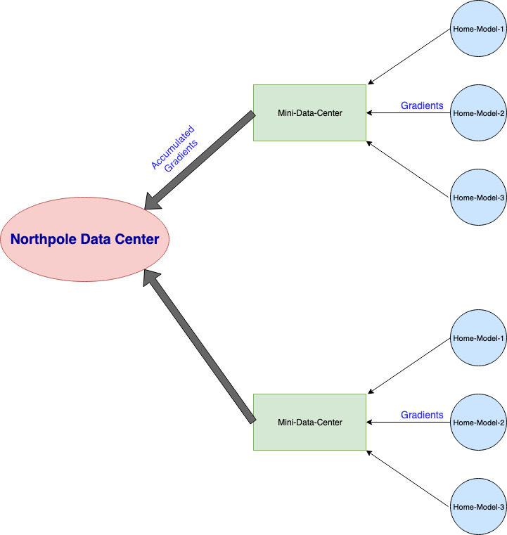

# Welcome

Thank you so much for checking this tutorial out. It was originally made as material for a talk that I had intended to
cover, but I quickly realized that:

1) it would be nice to share this information with the internet
2) to create a realistic scenario, there would need to be quite a bit of code and discussion
3) this is far more material than would fit in a single hour

and so here it is!

Throughout the process, I recommend starting with the `X_day_0.py` and coding things on your own to see how I would have
done it. Not that I'm the gold standard, but it would give you better context for the final day's code (where we use
category theory)

## Table of contents

1) [Disclaimer](#disclaimer)
2) [Backstory and Setup](#backstory)
3) [Problem Setup](#setup)
    - [Note](#note)
    - [Scenario](#scenario)
4) [Special Thanks](#thanks)

## Disclaimer

As you're reading through this, remember that you might have very well stumbled into these concepts on your own. Knowing
these concepts
doesn't magically make you a better developer, it just provides a framework of thinking and abstracting - ultimately, it
is still up to
you to figure out how to apply and use these concepts in your code.

# Backstory

You sigh a big sigh of relief, slump back into your chair, and decompress; it's Dec 26th, and your team just pulled an
all-nighter supporting the big jolly man. You lean back into your chair and take a well-deserved swig of eggnog from
your hip flask.

Just then, your boss comes running into your room! "We just hit a new record-high f1-score of 0.99 and it's thanks to
you!"
she screams. In utter shock, you spill the eggnog all over yourself; your boss decides to overlook your on-the-clock
drinking just this once.

Anyway, she tells you that you've just been promoted from Senior ML-Elfgineer to Lead ML-Elfgineer, and you can't
believe your luck! She says, "You'll be head of our distributed training system," and you about pass out.
The last 4 Leads elves quit because of the spaghetti code, continually increasing demands and faulty data centers.

Fear not! Let's walk through the process and see how you keep your code clean and your sanity intact.
Also, put in your vacation requests
because you'll need them.

# Setup

## Note

Throughout this tutorial, we lean heavily on the [Haskell Documentation](https://www.haskell.org/documentation/). We do
this because we believe that
Haskell is the best in terms of applied category theory $\cap$ software engineering. You do not need to read Haskell as
we will hold your hand through this process.

## Scenario

In this scenario, we start with a simple problem and gradually build it up! Santa's workshop (their research arm) has
embedded "naughty-or-nice" IoT devices in all the outgoing presents; this allows us to gather speech data to determine
if the children (or adults who still believe) have been good or bad.

Our problem model here is similar to a Federated Learning problem and you can read more
at [Federated with Google](https://federated.withgoogle.com/). At a high level, we've got many IoT devices doing
on-device gradient calculations before sending the gradients up to the central server, codenamed **The South Pole** (aka
TSP, the Travelling Santa Problem)

> HD -> TSP

---

Let's walk through how the problem might evolve over time and how you can structure your code so
you don't become this person below.

# Thanks

I'd like to thank:

- [Anooj Patel](https://www.linkedin.com/in/nooji/) for his insightful comments and his pointers into cleaning up the material. It would not be where it currently is without his insights.