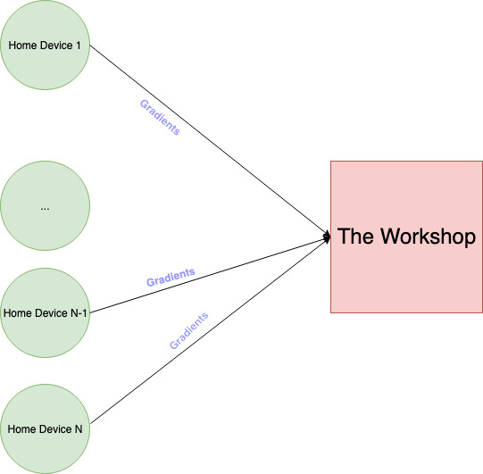

# Backstory

You sigh a big sigh of relief, slump back into your chair, and decompress; it's Dec 26th, and your team just pulled an
all-nighter supporting the big jolly man. You lean back into your chair and take a well-deserved swig of eggnog from
your hip flask.

Just then, your boss comes running into your room! "We just hit a new record-high f1-score of 0.99 and it's thanks to
you!"
she screams. In utter shock, you spill the eggnog all over yourself; your boss decides to overlook your on-the-clock
drinking just this once.

Anyway, she tells you that you've just been promoted from Senior ML-Elfgineer to Lead ML-Elfgineer, and you can't
believe your luck! She says, "You'll be head of our distributed training system," and you about pass out.
The last 4 Leads elves quit because of the spaghetti code, continually increasing demands and faulty data centers.

Fear not! Let's walk through the process and see how you keep your code clean and your sanity intact.
Also, put in your vacation requests
because you'll need them.

# Setup

In this scenario, we start with a simple problem and gradually build it up! We've got a distributed
ML framework, where we've got data centers all over the world! To remain innocuous, we have the following architecture:

At each house in a city-block, we use a single model to calculate the gradients. These gradients are
propagated up to a **mini-data-center** (MDC), where they are accumulated before being sent up to our HQ in the
**North Pole data center**, (NPDC). Sort of like the following:

> NPDC <- MDC <- in-home-model

. The motivation here is that this allows us to keep our data centers small and our presence a secret; we can't have a
giant data center somewhere in the city (can you imagine what humans might do if they found
out about us?)

---

Let's walk through how the problem might evolve over time and how you can structure your code so
you don't become this person below.

